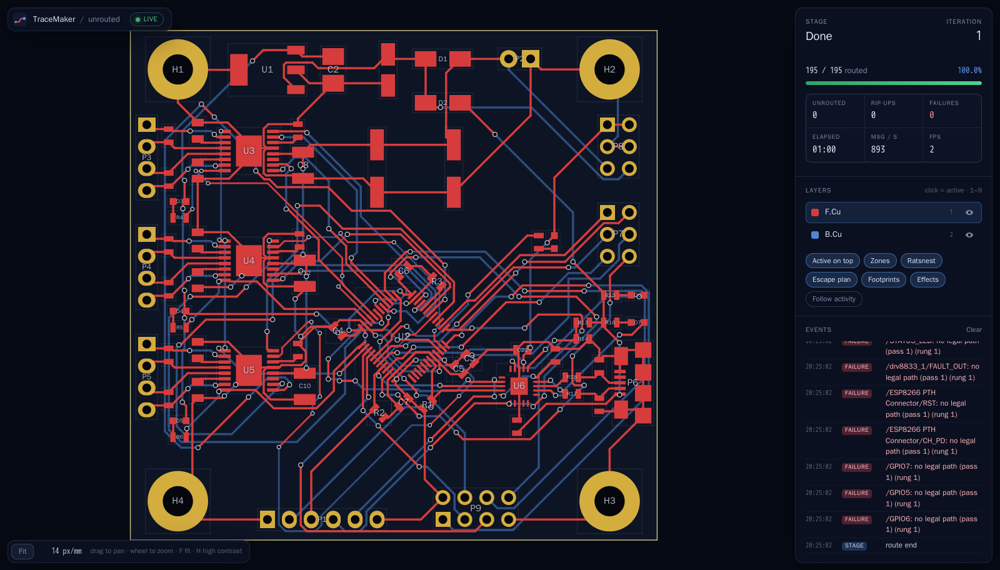

# TraceMaker

**An autorouter and component placer for KiCad.** You give it a `.kicad_pcb`; it draws the tracks and vias and
writes them back into the file.



*The live viewer after routing a three-channel motor driver: 195 of 195 connections, front copper in red, back in blue.*

## In one minute

- **What it does:** routes unrouted connections on KiCad 9 and 10 boards, and can place components first.
- **How it is judged:** by KiCad's own design-rule check (`kicad-cli pcb drc`), not by its own opinion.
- **What it never does:** touch anything it did not create. The rest of your file round-trips byte for byte.
- **What it runs on:** Linux, C++20. A CUDA 12.x GPU speeds it up; it works without one.
- **Status:** release 0.8.0. Licence GPL-3.0-or-later.

## How good is it?

Share of boards routed with **every connection made and no KiCad error added** (PCBench, 120 s per board):

| Tier | Boards | TraceMaker | Freerouting 2.5 |
|---|--:|--:|--:|
| A (routine) | 40 | **100%** | 100% |
| B | 40 | **70.0%** | 50.0% |
| C | 30 | **63.3%** | 46.7% |
| D (hardest) | 22 | **54.5%** | 36.4% |

Freerouting's figures are its own published results on the same boards.

**Known limits, stated plainly:**

- Placing a board from scratch gives 85% clean boards on held-out designs; the project's target was 90%.
- On boards with dense packages (BGAs, fine-pitch QFNs), 41% come out clean.
- It uses more vias than Freerouting.

Full detail: [design and results report](report/report.pdf) ·
[roadmap and test report](report/roadmap_testing.pdf) (all 132 tests, every benchmark run).

## Quick start

**1. Build**

```
cmake --preset release && cmake --build --preset release
```

No CUDA? Use `cpu-only` instead of `release` in both commands.

On macOS (Apple silicon), with Apple's Command Line Tools and
`brew install cmake ninja eigen cli11 nlohmann-json catch2 zstd boost clipper2`:

```
cmake --preset macos-metal -DCMAKE_PREFIX_PATH="$(brew --prefix)" && cmake --build --preset macos-metal
```

`macos-cpu` builds without Metal. Metal speeds up the cost-to-go fields only; see [docs/07-gpu.md](docs/07-gpu.md) §8.

**2. Route a board**

```
build/release/src/app/tracemaker route board.kicad_pcb -o routed.kicad_pcb
```

**3. Watch it work** (optional)

```
cd viewer && npm install && npm run build && cd ..
build/release/src/app/tracemaker route board.kicad_pcb -o routed.kicad_pcb --view --hold
```

Then open `http://localhost:8766/` in a browser.

**4. Check the result with KiCad**

```
kicad-cli pcb drc --format json -o drc.json routed.kicad_pcb
```

No KiCad installed? `scripts/kicad-cli` runs it from the `kicad/kicad:10.0.6` Docker image; put it on your `PATH`.

## What you need

- **Ubuntu 26.04** (what it is developed on).
- **Compilers:** GCC 15 (what it is built and tested with; older versions are untried). With CUDA 12.x, also
  GCC 13 or 12 for the GPU code.
- **Libraries:** Boost, Eigen, oneTBB, fmt, spdlog, FlatBuffers, SQLite, Catch2, pybind11, Clipper2 (fetched and
  built with the project when it is not installed).
- **Docker**, only for the KiCad checks and the tests that compare with KiCad.

<details>
<summary><b>Choosing compilers and build presets</b></summary>

Presets: `release`, `debug`, `cpu-only` (no CUDA), `asan`, `tsan`; on macOS `macos-metal`, `macos-cpu`.

The presets do not fix the compilers. By default the build takes:

- for C++: the newest of `/usr/bin/g++-15`, `-14`, `-13`;
- for CUDA host code: `/usr/bin/g++-13` or `-12` (nvcc 12.4 rejects newer ones).

To choose your own:

- C++: `CXX=/path/to/g++ cmake --preset release`, or `-DCMAKE_CXX_COMPILER=...`
- CUDA host: `TM_CUDA_HOST_CXX=/path/to/g++`, or `-DCMAKE_CUDA_HOST_COMPILER=...`

`ccache` is used when it is installed.

</details>

## Common tasks

Every command below starts with `build/release/src/app/tracemaker` unless it says otherwise.

| I want to… | Command |
|---|---|
| Route a board (120 s limit) | `route board.kicad_pcb -o out.kicad_pcb --time 120` |
| Get the same result every time | `route board.kicad_pcb -o out.kicad_pcb --work 50000000` |
| Watch the routing live | `route board.kicad_pcb -o out.kicad_pcb --view --hold` |
| Route everything again, old tracks removed | `route board.kicad_pcb -o out.kicad_pcb --reroute` |
| Run a design-rule check | `drc board.kicad_pcb --json report.json` |
| See a summary of a board | `inspect board.kicad_pcb` |
| Find pins that cannot escape their package | `escape board.kicad_pcb` |
| See which parts and layout rules it detects | `rules board.kicad_pcb --mode on` |

<details>
<summary><b>Placing components</b></summary>

The placer is a separate program: `build/release/src/place/tracemaker-place`.

| I want to… | Command |
|---|---|
| Improve a placement, and keep mine if the new one routes worse | `tracemaker-place in.kicad_pcb -o out.kicad_pcb --mode auto --route-check 3000000` |
| Let the router steer the placement | `tracemaker-place in.kicad_pcb -o out.kicad_pcb --mode routable` |
| Nudge a few parts to fix routing failures | `tracemaker-place in.kicad_pcb -o out.kicad_pcb --mode eco` |
| Place a board that has no placement yet | `tracemaker-place in.kicad_pcb -o out.kicad_pcb --mode routable --scratch` |

Locked parts, edge connectors and keep-outs are never moved or violated. A part that fits nowhere legally is set
down beside the board and reported.

</details>

<details>
<summary><b>More route options</b></summary>

- `--threads N`: threads. Eight differently configured routers run in parallel and the best result is kept.
- `--variants N`: how many of those eight to run.
- `--work N`: a budget in search steps instead of seconds. The output is then identical at any thread count.
- `--no-gpu`: compute on the CPU only. Results are identical.
- `--diff-pairs`: route differential pairs side by side at the rule's gap.
- `--component-rules on`: apply detected layout rules (keep-outs, widths from impedance and current).
- `--rules-override FILE`: correct what was detected (doc 15 §6.3).
- `--escape-plan`: reserve exit paths from dense packages in every variant (two use them by default).
- `--cut-report`: report lines across the board that more nets must cross than tracks fit.
- `--no-tracks-on In1.Cu,In2.Cu`: no new tracks on these layers (vias still pass through and reach the planes).
  `--layer-cost In1.Cu=4,In2.Cu=4`: tracks there cost that many times their length, so they are a last resort.
- `--kb FILE` / `--no-kb`: the knowledge base of earlier runs.
- All-SMD boards with inner planes (doc 05 §26; refill the zones afterwards, e.g. `kicad-cli pcb drc --refill-zones
  --save-board`): `--soft-zones` (zone fills do not block other nets; an inner plane no pad touches becomes a via
  target), `--keep-vias-off-pads` / `--vias-off-pads-below MM` (no via in an SMD pad narrower than 2 mm),
  `--via-in-pad` (the board's minimum via in an inner ball that has no other way out), `--first-nets A,B` (these
  nets go first, also after restarts, and other nets do not rip them). With `--soft-zones` the job then refills
  the zones in memory, routes what the refill left unconnected once more, and reports `unconnected_after_refill`
  (the exit code follows it; `--no-refill-repair` only counts; doc 05 §36). The written board keeps its old fills.
- `tracemaker drc --refill-zones`: judge the fills the current copper would get, like kicad-cli's flag.

</details>

<details>
<summary><b>KiCad plugin</b></summary>

`kicad_plugin/` is a KiCad 10 action plugin. It routes the open board and adds the result as **one commit**, so a
single Ctrl-Z removes it. It can also re-route existing copper, move footprints and refill zones.

- Build the package: `python3 scripts/make_pcm_package.py`
- Install it in KiCad: Plugin and Content Manager → Install from File…
- Details and settings: [kicad_plugin/README.md](kicad_plugin/README.md)

</details>

## Run the tests

```
scripts/fetch_fixtures.sh          # downloads the test boards (about 2.4 GB), once
ctest --preset release             # 132 tests, about 5 minutes
```

- Tests that need a board or `kicad-cli` **skip** when it is missing; they do not fail.
- After the first build, run `scripts/fetch_fixtures.sh derived` once more to build the placement test set.

<details>
<summary><b>About the test boards</b></summary>

- They are downloaded from their original sources into `bench/data/` and are **never part of this repository**.
  About half of the PCBench boards state no licence.
- They are pinned to the exact versions the published results were measured on.
  `TM_FIXTURES=latest scripts/fetch_fixtures.sh` takes the newest upstream versions instead.
- Sets: Freerouting's fixtures including PCBench (1,157 boards), DAC 2020 (11), KiCad's demo projects (19).

</details>

## Run the benchmark

```
python3 bench/run.py --tier B --limit 40 --time 120 --jobs 2 --threads 8
```

- Each run writes `bench/results/<run>/`: the routed boards, a result per board, and `summary.json`.
- Every board is compared with Freerouting's published result for the same file.

<details>
<summary><b>More benchmark results</b></summary>

**Held-out quality study** (`bench/quality_bench.py`, measured 2–3 October 2026): 60 boards never used in
development, with Freerouting 2.5.0-RC12 and 1.9.0 run on the same machine and everything judged by KiCad.

| | TraceMaker | Freerouting 2.5 | Freerouting 1.9 |
|---|--:|--:|--:|
| Boards clean in KiCad | 73–78% | 3% | 32% |

Against Freerouting 2.5, TraceMaker's tracks are 5% shorter with 28% fewer bends, but it uses 43% more vias.

**DAC 2020** (10 boards, same judge): TraceMaker 60% clean, as many as the human-routed originals;
Freerouting 2.5 10%; Freerouting 1.9 20%.

**Older Freerouting, tiers A to D:** version 2.4.1 scores 87.5%, 12.5%, 16.7% and 0.0%.

</details>

## Where things are

| Folder | What is in it |
|---|---|
| `src/route` | the router |
| `src/place` | the placer |
| `src/drc` | the design-rule check |
| `src/io/kicad` | reading and writing KiCad files |
| `src/crules` | component-aware layout rules |
| `src/gpu` | CUDA and Metal code, each with a CPU twin |
| `src/server`, `viewer/` | the live viewer |
| `kicad_plugin/` | the KiCad plugin |
| `bench/` | benchmark tools |
| `tests/` | tests |
| `docs/` | design documents; start at [PLAN.md](PLAN.md) |
| `report/` | the two PDF reports |

Other folders: `src/core`, `src/sexpr`, `src/model`, `src/geom`, `src/learn`, `devsite/` (a progress dashboard).

## Read more

- [PLAN.md](PLAN.md) and [docs/](docs/): how it is designed.
- [docs/12-decisions.md](docs/12-decisions.md): every design decision and why.
- [dev/assumptions.md](dev/assumptions.md): choices made without asking the owner.
- [report/report.pdf](report/report.pdf): method and results, with figures.
- [report/roadmap_testing.pdf](report/roadmap_testing.pdf): the roadmap and all testing.
- [CONTRIBUTING.md](CONTRIBUTING.md): how to report a bug or send a change.

## Licence

GNU General Public License, version 3 or later (`GPL-3.0-or-later`). See [LICENSE](LICENSE).

[NOTICE](NOTICE) adds a permission to link with NVIDIA's CUDA runtime, lists third-party components, and credits
the KiCad demo projects behind `tests/truth/`. Benchmark boards are downloaded, not redistributed, and keep their
own licences.
